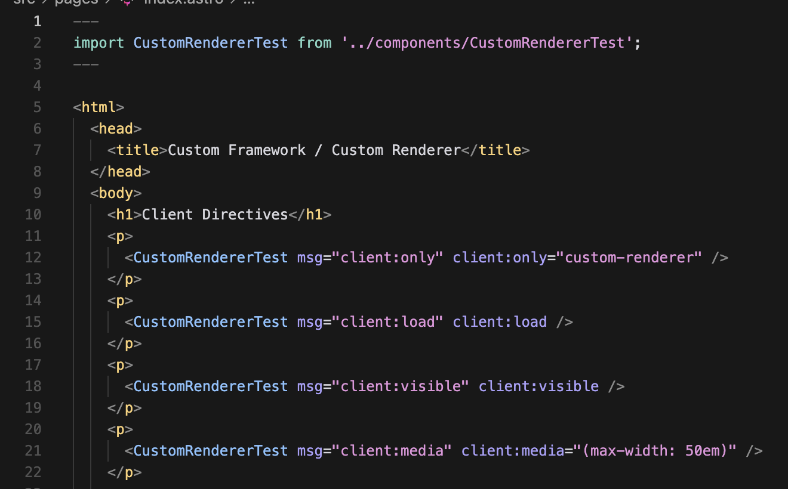
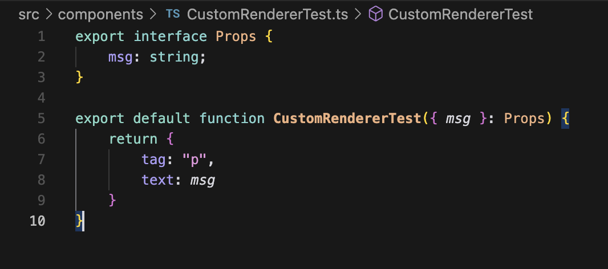
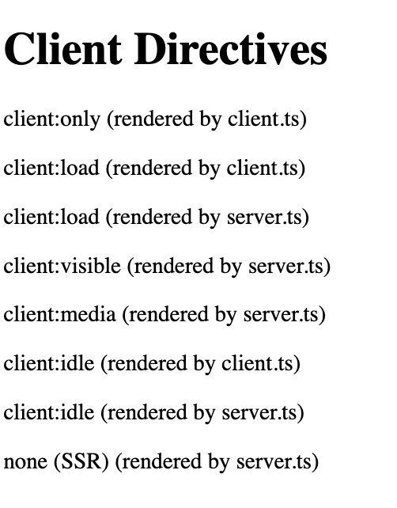

# Astro Custom Frontend Framework / Custom Renderer Starter - Astro Example Project

This is a template for an Astro integration that uses a custom renderer.

#### Invocation


#### Custom Markup/VDOM


#### Custom DOM rendering


## Setup

We use `pnpm` here, so please make sure it is installed.

```bash
npm i -g pnpm

# also install dependencies
pnpm i
```

## 🚀 Project Structure

Inside of your Astro project, you'll see the following folders and files:

```text
/
├── src/components/CustomRendererTest.ts
├── src/pages/index.astro
├── tsconfig.json
├── package.json
```

Please take a look at `src/astro.config.mjs` to see how the `custom-renderer` is  integrated. You'll find it's implementation in `../packages/custom-renderer`. Resolving by module name works, because we're using a monorepo with `pnpm`. In a real-world use-case you'd publish your renderer module via NPM.

Client-side rendering of DOM sub-trees is implemented in `../packages/custom-renderer/client.ts` while
`../packages/custom-renderer/server.ts` implements SSR rendering (HTML serialized rendering).

The `src/pages/index.astro` demonstrates the various client directives to render Components
that use the custom framework/custom renderer and `src/components/CustomRendererTest.ts` implements one Component that shows the use of a custom markup/VDOM in use.

## 🧞 Commands

All commands are run from the root of the project, from a terminal:

| Command       | Action                                                                                                                                                                                                                           |
| :------------ | :------------------------------------------------------------------------------------------------------------------------------------------------------------------------------------------------------------------------------- |
| `pnpm run dev`    | Run in dev mode and check your custom renderer                                                    |
| `pnpm run build` | Build for production  |
| `pnpm run preview` | Build for production, then preview |
